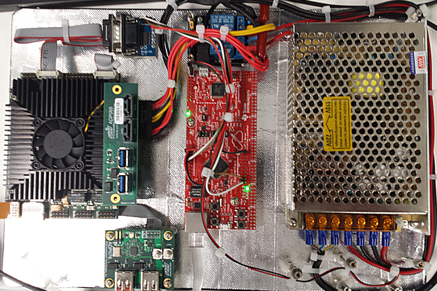

# CMA34D

The CMA34D is an embedded i7 board. It needs 12V and 5V supplies. It
does not have a BMC (Base Management Controller) so cannot be controlled
remotely.

We used a [Stellaris Connected Launchpad](http://www.ti.com/tool/ek-tm4c1294xl)
connected to an RS232 level converter and a 2-way relay module, together with a
suitable power supply.

In the picture, the CMA34D is at the left, with the TTL-to-RS232
converter above it. The Launchpad is in the middle, with the relay board
above it, partially obscured by the wiring harness. The power supply is
on the right. All is mounted on a cheap polyethylene breadboard that has
been covered in aluminium tape to provide a ground plane; all the boards
and cables are mounted on 20mm standoffs.

Software for the launchpad is available at
<https://github.com/data61/echronos-lwip> Use the master branch, and the
project is at
packages/machine-tm4c1294-launchpad/projects/embedded_pc_testbed_src

The relays are connected to pins PK6 and PK7 on the launchpad; the UART
to pin PA0 (Rx) and PA1 (Tx). You'll need to swap the wires to the level
converter (so Rx from the launcpad connects to Tx on the level
converter, and vice versa); and make sure jumpers J4 and J5 are set to
`UART`.
