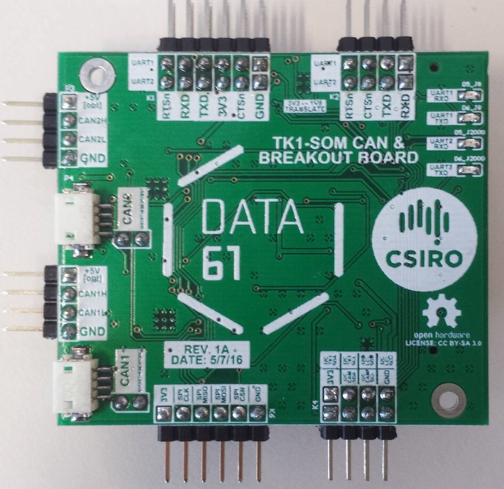
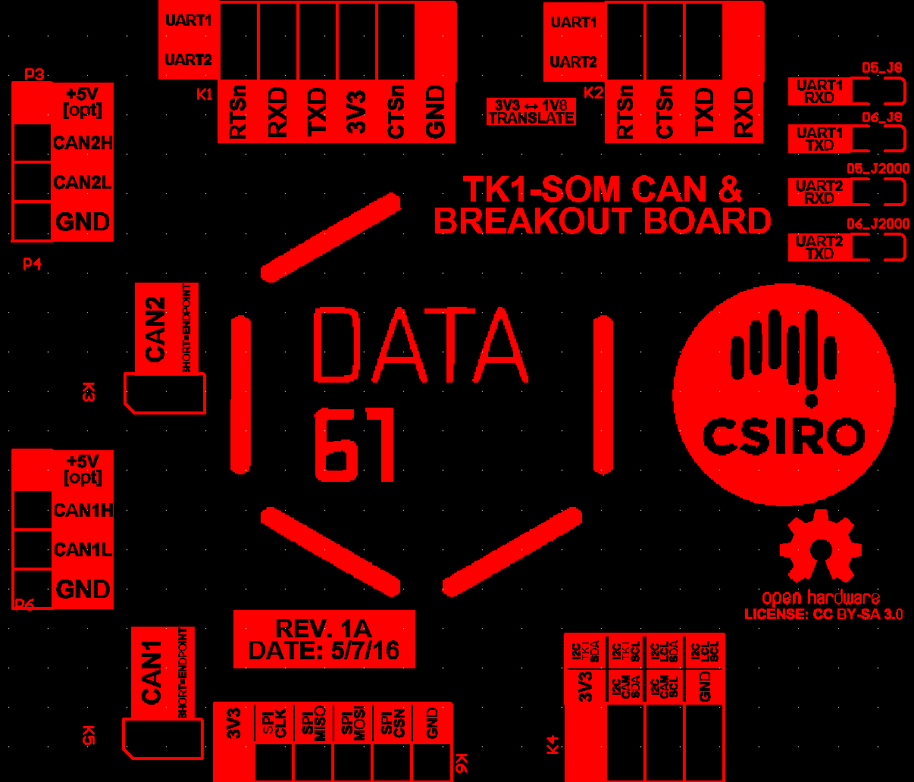

# The CAN Daughterboard

The CAN Daughterboard is an open-hardware
**CAN/SPI/I2C/Serial board** designed by the Trustworthy Systems group,
that can be mounted below the power supply module of
the TK1-SOM. It provides **two CAN buses** implemented with MCP2515
(on the TK1-SOM's SPI bus) and voltage conversion for the two serial
ports.

## Mounting
 The board attaches to the bottom of a TK1-SOM via the
expansion connector. No further work should be needed to enumerate the
device given a kernel supporting GPIO chipselects.

Note the unpopulated standoff holes on the rightmost image above --- it
is possible to fit a standoff of the same type already installed in the
TK1-SOM to stabilize the 'tower' making it easier to work with.

The part numbers of the standoffs between the CAN daughterboard and TK1
is the same as is already used between the CPU & GPU board. Order codes:

+ **STANDOFF** - HEX M2.5 x 16MM ALUMINUM M-F (M2111-2545-AL)
      between pcb standoff
+ **SCREW** - M2.5 x 5 MM SS PAN HEAD PHILIPS (92000A103) bottom
      pcb screw

## Using Linux with this daughterboard for CAN
(**hello world & testing**) See [Using CAN on L4T through an MCP251X](../L4TCan)

## Pinout detail
 The font on the silkscreen indicating pins is
difficult to see once the tower is assembled (wasn't enough space on the
top) - See this picture (view taken from **bottom**):

### Warning - UART Level Converter:

-   If using the level converter on the board, and if you are
    getting **junk from your 3V3 serial cable**, read this:
-   Unfortunately there is an issue with these level converter
    chips, in some impedance situations the rise time is much worse
    than indicated on the datasheet. Basically, with some serial
    cables the converter will garble signals at a high baud rate
    (> 57600).
-   This can be circumvented by changing your u-boot and extlinux to
    use a slower baud rate. 9600 is very safe, anything up to about
    57600 should be fine --- start slow and work up.

If you need the faster baud rates (or don't want to change the default
settings), **use a 1V8 USB-TTL cable** and plug it straight into the
TK1 as usual. This will be fixed in a future revision.

## TK1 SOC Connections
 Useful for writing drivers - this is a list of
which pins on the board correspond to which SOC pins:

Note: All I2C signals operate at 3V3 on their 0.1" headers, except
I2C_CAM which is selectable from 1V8<->3V3 in software.

|  PIN         |  BALL   |  PERIPHERAL ID   |
|--------------|---------|------------------|
|I2C_CAM_SCL   |AF8      |I2C3_CLK          |
|I2C_CAM_SDA   |AG8      |I2C3_DAT          |
|I2C_TK1_SCL   |Y2       |I2C2_CLK          |
|I2C_TK1_SDA   |AA2      |I2C2_DAT          |
|I2C_LOCAL_SCL |P6       |I2C1_CLK          |
|I2C_LOCAL_SDA |M6       |I2C1_DAT          |

All SPI signals out of the TK1 are at 1V8, but are translated to 3V3 by
the board (the 0.1" header operates at 3V3)

|  PIN    |  BALL   |  PERIPHERAL ID   |
|---------|---------|------------------|
|SPI_CLK  |AG15     |SPI1A_SCK         |
|SPI_MISO |AL18     |SPI1A_DIN         |
|SPI_CSN  |AL16     |SPI1A_CS0         |
|SPI_MOSI |AK17     |SPI1A_DOUT        |

All UART signals out of the TK1 are at 1V8, but are translated to 3V3 by
the board. Note that UART signals will only be present on the board
outputs if the uart is actually jumpered to the converter!

|  PIN      |  BALL   |  PERIPHERAL ID   |
|-----------|---------|------------------|
|J8_RTSn    |V5       |UD3_RTS           |
|J8_CTSn    |V9       |UD3_CTS           |
|J8_TXD     |V4       |UD3_TXD           |
|J8_RXD     |U4       |UD3_RXD           |
|J2000_RXD  |L0       |UART2_RTS_N       |
|J2000_TXD  |M8       |UART2_CTS_N       |
|J2000_CTSn |M1       |UART2_TXD         |
|J2000_RTSn |P4       |UART2_RXD         |

Note that TXD (1V8) is translated to TXD (3V3). NOT TXD (1V8) <->
RXD (1V8). This means that the jumper from the TK1-SOM should go from
it's TX to RX on the daughterboard for a standard ftdi pinout to work.

Note that GPIOs aren't actually brought out by the board but they are
used by the CAN controller (diagram below).

|  PIN     |  BALL  |  PERIPHERAL ID   |
|----------|--------|------------------|
|TK1_GPIO0 |AF29    |GPIO3_PS.05       |
|TK1_GPIO1 |AA26    |GPIO3_PT.00       |
|TK1_GPIO2 |AC30    |GPIO3_PS.06       |
|TK1_GPIO3 |AA31    |GPIO3_PS.02       |
|TK1_GPIO4 |V28     |GPIO3_PS.03       |
|TK1_GPIO5 |W31     |GPIO3_PR.00       |
|TK1_GPIO6 |AB31    |GPIO3_PR.06       |
|TK1_GPIO7 |Y27     |GPIO3_PS.04       |

### CAN Controller (MCP25625) GPIO Usage:

## Construction Information

|Schematic                  |[canboard_v3.pdf](canboard_v3.pdf)                                   |
|PCB Sources Repository     |https://bitbucket.csiro.au/projects/OH/repos/tk1som-can-daughterboard|
|Gerber Files (in repo also)|[Tegra_CANboard_tofab_v1.zip](Tegra_CANboard_tofab_v1.zip)           |
|BOM (in repo also)         |[CanBoardBOMDraft1.xlsx](CanBoardBOMDraft1.xlsx)                     |

## Construction notes
 Components **R6, R14, R19, R23 should NOT be
mounted**. R6 and R19 are pull-up resistors that were found to cause
signal integrity issues, the other 2 resistors when mounted will supply
5v to the CAN lines and are optional.
