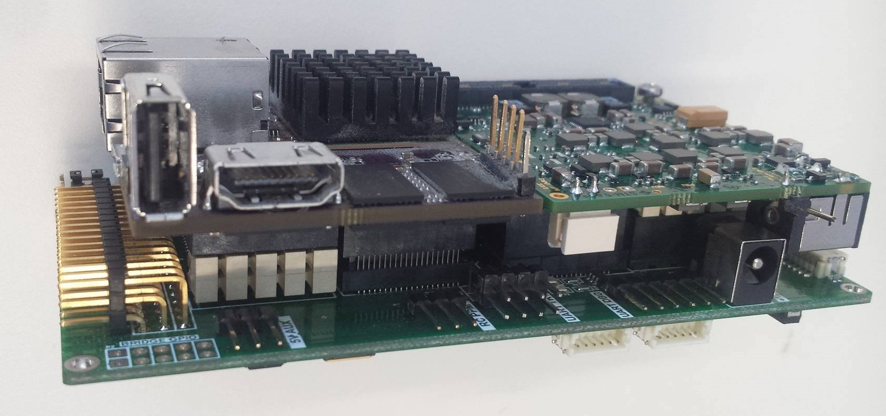
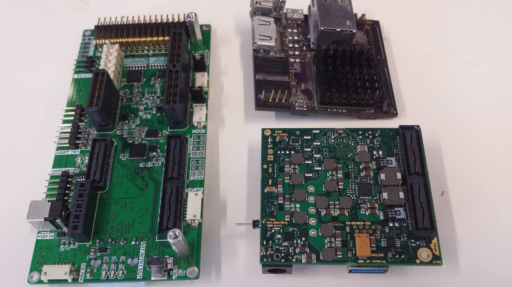
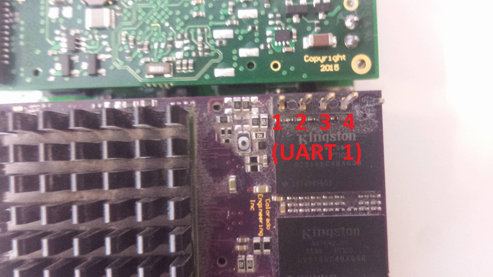
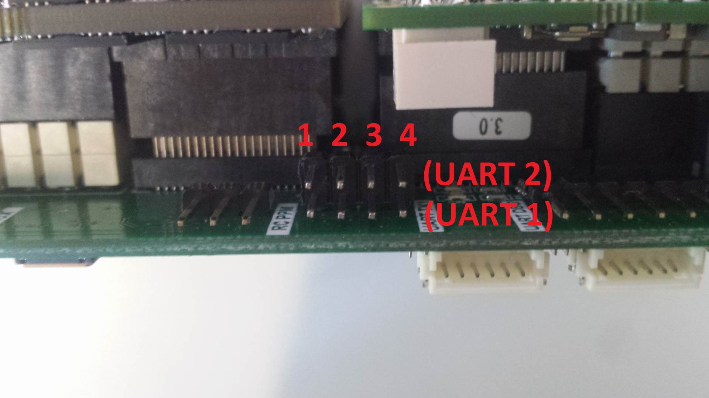
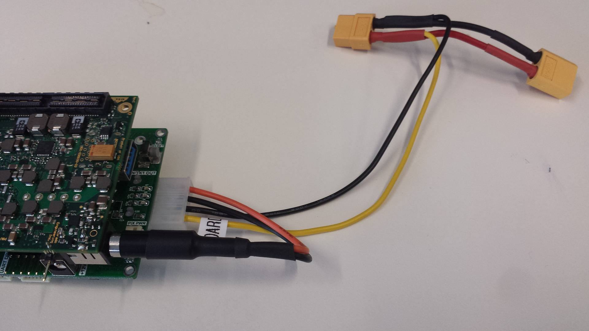
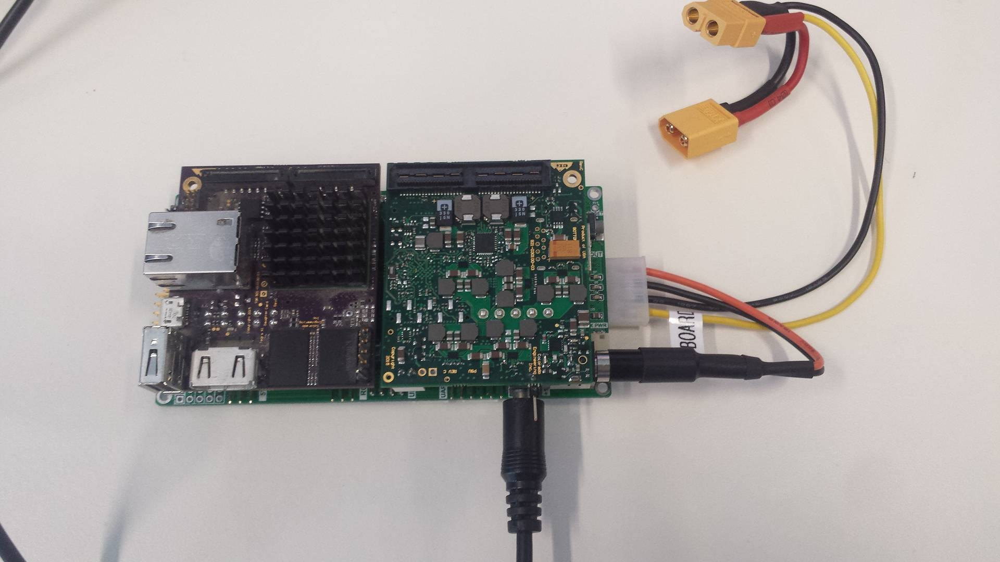
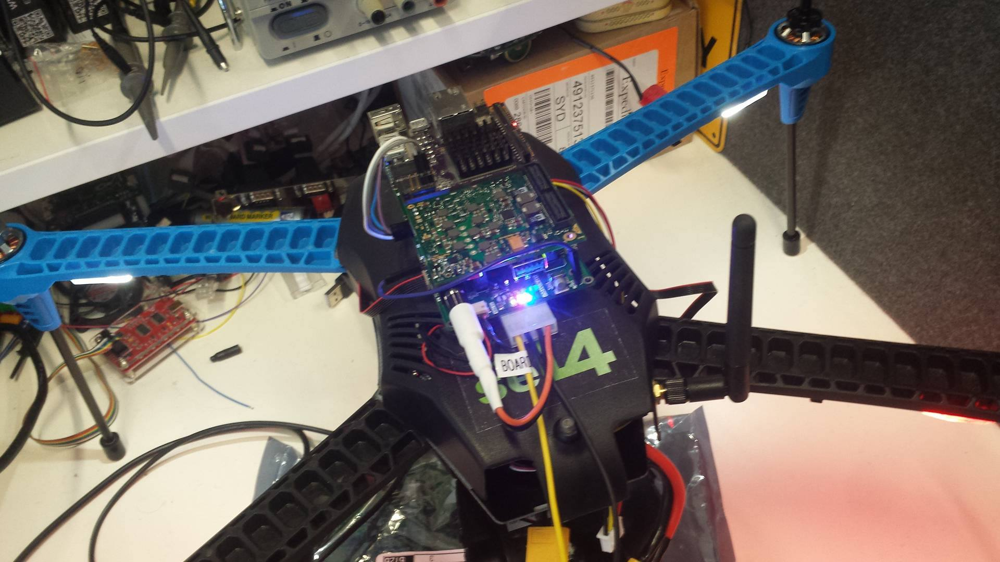
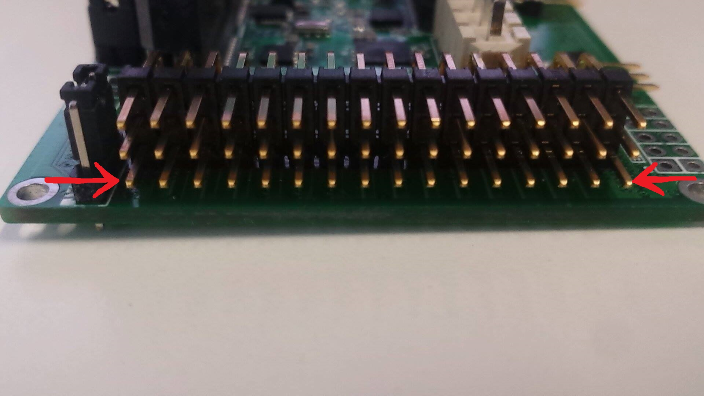

# The TK1-SOM Daughterboard

The TK1-SOM Daughterboard is an
open-hardware daughterboard designed by the Trustworthy Systems group
that can be mounted to the TK1-SOM. It provides **CAN
buses**, **serial**,**sensors**, **power management**, **PWM
outputs** and other features that allow the TK1-SOM to be used as a
flight controller for a quadcopter.

### Warning

- Don't plug in or unplug things from the daughterboard while it
        is turned on, especially the radio. The current transient will
        sometimes kill U13 (TPS563200 5V regulator). If only 1 of the
        LEDs above the white molex connector is lit, it is because U13
        is dead.

### Rough overview (top)

### Rough overview (bottom)

### With TK1

## Technical documentation

- [Schematic PDF](daughterboard_r3a_schematic.pdf) (See '[Technical errata for R3A](#errata)'
        for changes)
- Bill of Materials:
        [tegra_daughterboard_bom3.xls](tegra_daughterboard_bom3.xls)
- Project repository:
        [Altium files](https://bitbucket.csiro.au/projects/OH/repos/tk1som-quadcopter-daughterboard)

## Connecting the Daughterboard
 Going from a TK1-SOM, a pixhawk/IRIS
and a daughterboard to a functioning system requires:

- [Technical documentation](#technical-documentation)
- [Connecting the Daughterboard](#connecting-the-daughterboard)
  - [Mounting the TK1 to the daughterboard](#mounting-the-tk1-to-the-daughterboard)
  - [Jumpering the UART level translators](#jumpering-the-uart-level-translators)
  - [Jumpering the RESET button](#jumpering-the-reset-button)
  - [Attaching the pixhawk power cable](#attaching-the-pixhawk-power-cable)
  - [Attaching the CAN bus cable](#attaching-the-can-bus-cable)
  - [Attaching the telemetry cable](#attaching-the-telemetry-cable)
  - [Connecting the power harness](#connecting-the-power-harness)
  - [Connecting the battery OR external PSU](#connecting-the-battery-or-external-psu)
  - [Everything connected](#everything-connected)
  - [Debugging output and finding grounds](#debugging-output-and-finding-grounds)
- [Errata](#errata)
  - [Technical errata for R3A, to be fixed next revision](#technical-errata-for-r3a-to-be-fixed-next-revision)

### Mounting the TK1 to the daughterboard
 Before mounting the
TK1-SOM to the daughterboard, you will have to disassemble the TK1-SOM.
This will involve:

- Removing the fan screw
- Unscrewing the standoffs
- Separating the 2 module 'halves'
- Removing the fan connector

This must be done with care as it is easy to damage the TK1. Your goal
is this:

Now you can start attaching the TK1 to the daughterboard. It's easy to
identify which half goes where by looking at the connectors on the
bottom, or the overview at the top of this page.

Firmly press both of the TK1 halves into their sockets. Try to use
unpopulated parts of the PCB as 'finger positions' to avoid damaging
components or connectors.


Standoffs can optionally be added in this step for extra support
(the friction fit supplied by the TK1 connectors should be more than
sufficient in most cases). Each module has a single standoff point for
an M2.5 screw, bolt, and standoff:

The end result should look like the image under [With TK1](#with-tk1) near the top of this page


### Jumpering the UART level translators
 For the daughterboard to do
any level translation, it needs to be connected to the TK1's UARTs. We
achieve this by jumpering the TK1's UARTs to the 'UART TK1' connector on
the daughterboard. (See 'rough overview', top view)

The pinout of the TK1's UARTS is the same as the pinout of the
daughterboard's UART inputs. Observe:

The pinout of the TK1 UARTS is:

|PIN 1 |RX    |
|PIN 2 |TX    |
|PIN 3 |CTS-L |
|PIN 4 |RTS-L |

Since we aren't using flow control, you only need to connect pin 1 (TK1)
to pin 1 (daughterboard), and pin 2 - pin 2 for both UARTS. You should
end up with:

**Note**: On this board, UART1 is connected to the RADIO output, the
FTDI port, and the activity LEDs. UART2 is connected to the GPS output.
It is possible to swap these at the TK1 input side without consequence
(this would put the kernel dump through the GPS output, and UART2
through telemetry). Additionally, one can disconnect these jumpers and
use an 'ordinary' 1V8 converter for debugging (See
[debugging & grounds](#debugging-output-and-finding-grounds) below).

### Jumpering the RESET button
 It's difficult to access the TK1's
reset button when it is mounted, so there is a secondary reset button on
the daughterboard that can optionally be used. First, you must solder a
pin to the hole next to the reset switch on the TK1 (as RESET isn't
brought out on any of its connectors):

From here, you want to jumper this pin to the 'RESET' pin on the
daughterboard (This is the pin just to the right of the grey switch):

Your end result is:


As this reset switch is just a momentary short to ground, it is
very easy to make your own reset switch that may be larger or more
conveniently mounted elsewhere on the quadcopter. Essentially you just
need a momentary switch between the TK1 pin and ground - the signal is
debounced etc on the TK1.


### Attaching the pixhawk power cable
 --(The pixhawk power cable is
how the daughterboard delivers power to the pixhawk. Note that this is
very different to the previous daughterboards - we do not use the IRIS'
power output (that would normally go into the pixhawk) for
anything.)--OUTDATED DUE TO POSSIBLE RAIL INTERACTION

The pixhawk should be connected to the IRIS power supply as it would be
in a vanilla configuration, to avoid any interaction with the
daughterboard's rails. Do NOT connect anything to the daughterboard's
'Power out to Pixhawk' connector.

### Attaching the CAN bus cable
 The CAN1 connector we are using
(labelled 'PRIMARY CAN CONNECTOR' on 'Rough overview - Top' at the top
of this page) is directly connected to the CAN port on the pixhawk.
Connect one end of the 4-pin DF13 connector to the pixhawk, and the
other to the daughterboard:

The left arrow points to the connector. The right arrow points to the
endpoint selection jumper. If the endpoint selection jumper is closed,
CAN1 will be terminated as an endpoint. In our situation, the pixhawk
and the daughterboard are endpoints, so the jumper should be closed for
CAN1.

Note that the connectors on the bottom and the top of the board are
connected in parallel so that the board can be used in more complex
network topologies, i.e the 2 left connectors are CAN1, and the 2 right
connectors are CAN2.

### Attaching the telemetry cable
 The telemetry connector to be
connected to the 3DR RADIO has a 'RADIO' label, and it is next to the
GPS connector - see 'Rough Overview - Bottom', above.

To connect it, find the 3DR RADIO cable inside the IRIS and just plug it
in:

### Connecting the power harness
 The power harness is how the
daughterboard supplies power to the TK1-SOM, and also how it intercepts
power from the IRIS' batteries (if it is running on batteries). This is
the power harness:

To connect it, plug in the molex connector under the daughterboard, and
then plug into the TK1-SOM's barrel jack. Do NOT plug this into the
'+12V IN' barrel jack on the side of the daughterboard. This is what you
want:

### Connecting the battery OR external PSU
 There are 2 ways of
powering up the daughterboard and pixhawk:

- 1: Using the TK1-SOM's ordinary power supply (for testing)
- 2: Using the LIPO battery on the quadcopter (for demoing)

The only difference from a functional point of view is that option 1
will only power the pixhawk, daughterboard, and TK1-SOM; not the rest of
the quadcopter. The LIPO will do the same, but also provide power for
the rotors etc.

Note that in both cases the power harness must be connected to supply
the TK1-SOM with power. If the TK1 power supply is used, the yellow
battery connectors should be unplugged.

In any case, for option 1: simply plug in the TK1 power supply to the
'+12V IN' jack (See 'Rough overview' - Top):

The TK1 and daughterboard will all turn on. (And the pixhawk if it is
connected unlike the above picture)

For option 2: Connect one end of the power harness to the main IRIS
power input:

and the other end to the battery: (Follow ordinary 3DR procedures before
doing this as it will turn everything on)

Similarly, everything should turn on as pictured.

### Everything connected
 Slightly more close-up photo of everything
connected and turned on:

### Debugging output and finding grounds
 To use an 'ordinary' 1V8
converter and debug things, you will likely want to:

- Connect the 1V8 converter to the primary UART on the TK1 (on
      the top) for kernel messages
- Swap UART1 with UART2 into the daughterboard, making the secondary
      UART go through telemetry. (i.e connect UART2 (TK1) to
      UART1 (Daughterboard) to get the secondary UART through telem)

Our 1V8 converters have the following pinout:

You want to connect TX (converter) to RX on the TK1, and RX (converter)
to TX on the TK1. You also need to connect a ground, which you can find
all along the bottom row of the servo connector:

(The entire bottom row is connected to ground)

## Errata

### Technical errata for R3A, to be fixed next revision

- The 'power out to pixhawk' connection on the daughterboard
        should not be used as it may cause a rail collision.
- All I2C lines CLK and DAT lines are reversed due to an error in
        the schematic supplied to us by CEI; this has been modwired to
        the correct connection on some boards.
- U8 (LSM303D, one of the many inertial sensors) is not mounted
        due to a footprint error.
- D10 & D11 CAN Reset diodes are not mounted on some boards. This
        has been tested OK, the diodes are just to improve CAN chip
        reset times - but we aren't actually using the CAN reset line.
- R35 & R45 to supply power through the CAN ports --(ARE)-- ARE
        NOT mounted, and should never be to avoid rail collisions.
- The LV cutout circuitry does not work. Since the IRIS battery is
        disconnected when not in use anyway, this should not be a
        huge issue. UPDATE: Reason is footprint error with TLV431 chip,
        swapping A/K fixes issue.
- On schematic sheet 5, the 'Do not populate' remarks indicate the
        wrong designators. They should indicate R35 & R45.
- R40 & R49 pull-ups on the SPI CSN line are not mounted. These
        were found to cause signal integrity issues. Additionally, the
        silkscreen for R51 and R49 is swapped on the PCB.
- R57 - R72 (Current limiting resistors for D12-D27), a value of
        560 ohm was used instead of 10K ohm to increase
        their brightness.

