# Using the Saleae Logic Pro 8 to debug a CAN bus
 
# Introduction
This page is a quick write up of how we used a logic analyzer to help
solve a message loss issue when using a CAN bus. We had two TK1-SOMs
connected together on a CAN bus. One of them runs Linux natively and the
other runs an seL4 CAmkES application that receives CAN frames and then
prints them out. We found that although the CAmkES application could
correctly receive and reply to individual CAN frames, when frames were
being received at the maximum rate of the bus the CAmkES application
would only print out the first, last and occasionally a frame in the
middle. Read more about CAN
[here](https://en.wikipedia.org/wiki/CAN_bus), and
[here](https://www.saleae.com/index) is the Saleae Logic Pro 8
site. Information about the TK1-SOM daughter board that we use is
[here](https://bitbucket.csiro.au/projects/OH/repos/tk1som-can-daughterboard/browse).


## Setup
 Each of the TK1-SOMs have a daughter board with a MCP25625
CAN controller on them that can communicate with the processor over SPI.
When a controller receives a CAN message it notifies the processor by
interrupting it over a GPIO line. The processor then reads the CAN
message out of the controller over SPI. We can use the LogicPro8 to
probe the CAN bus, the SPI bus and also the GPIO pin that the interrupt
is received on to get a feel for what is going on.

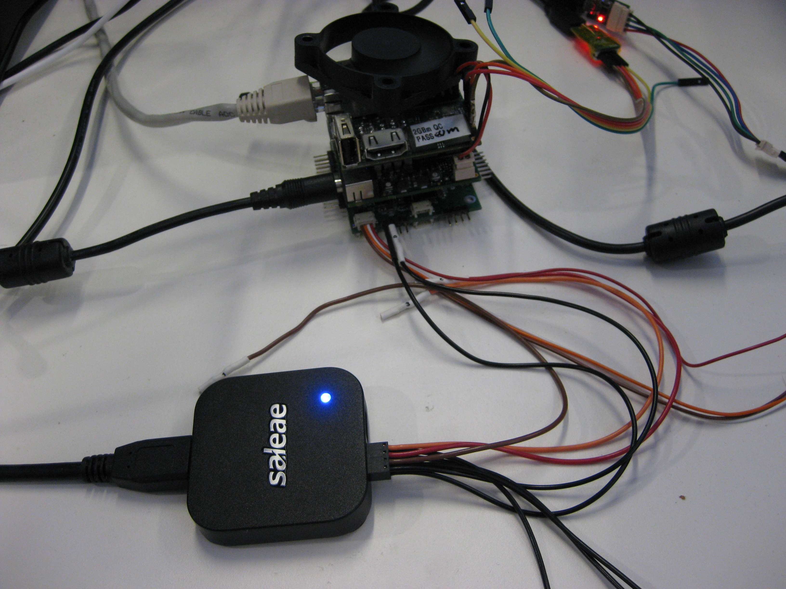

### Connecting to the CAN bus


On our daughter board (schematic above), our CAN bus pins are CAN1H,
CAN1L and GND. The Logic pro only needs to be plugged into CAN1L and GND
in order to decode CAN frames. We connect Channel 0 of the Logic pro as
shown: (Note that the schematic above shows the bottom of the daughter
board. So the order of the pins in the photo is reversed)

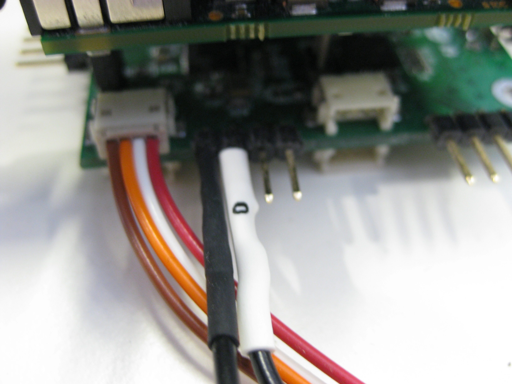

Saleae provides the [Logic](https://www.saleae.com/downloads)
software which is used to collect and analyse data.

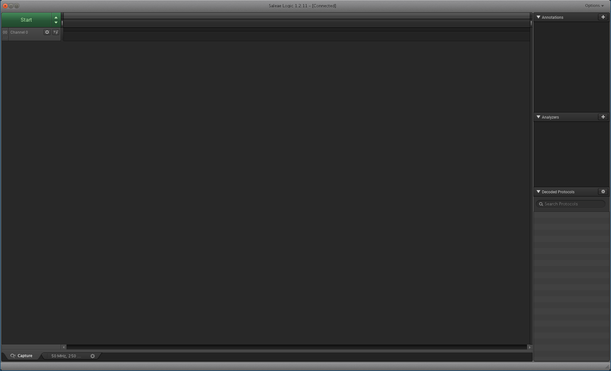

We configure Logic to collect at a rate of 50MS/s on channel 0 with
3.3+V

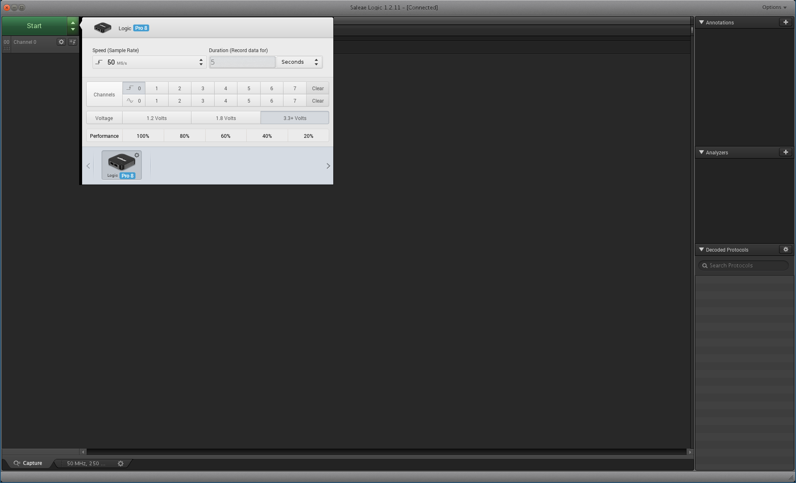

We add CAN as an analyser for Channel 0 and set the bitrate to 125000
which is what our TK1s are configured to use.

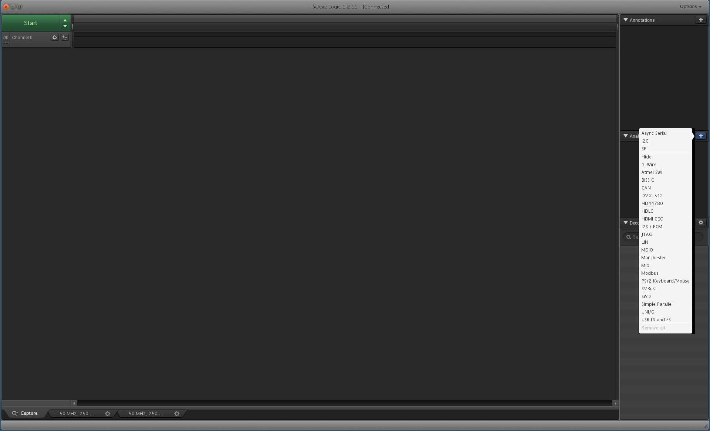
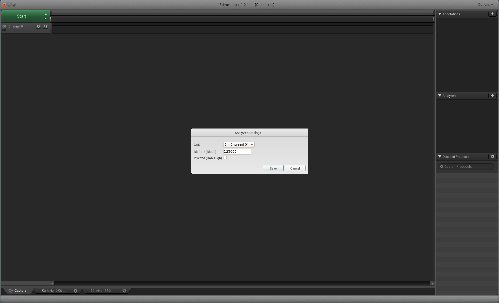

We press start and then send one CAN message from the Linux TK1 to the
seL4 TK1.
```
Native Linux:
ubuntu@tegra-ubuntu:\~$ cansend can0 5A1#11.22.33.44.55.66.77.88

seL4: Recv: error(0), id(5a1), data(11, 22, 33, 44, 55, 66, 77, 88)
```
In Logic we see that we measured the CAN message being transmitted over
the bus. On the side under Decoded protocols Logic reports the fields of
the message that was sent.

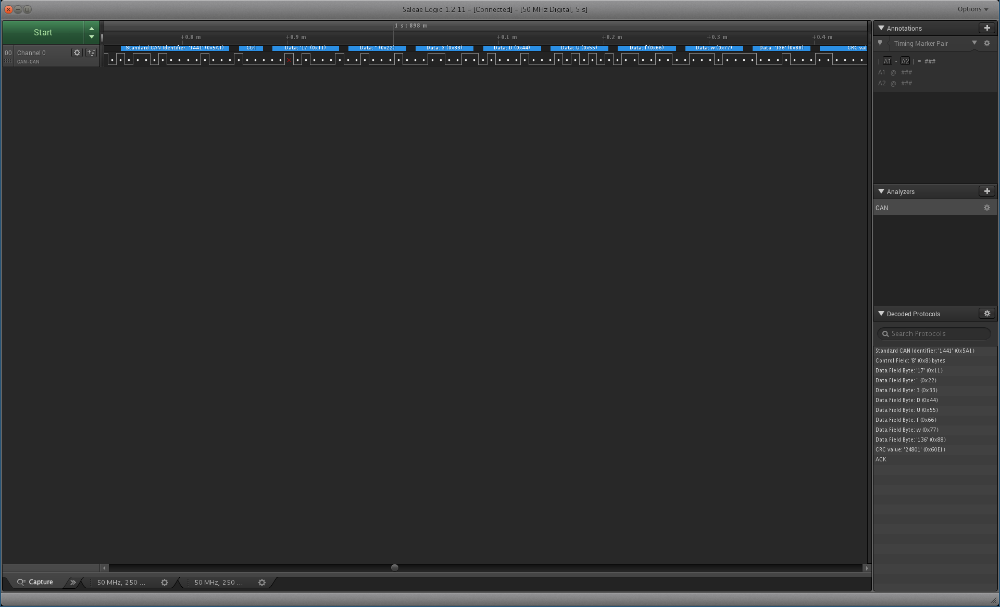

### Connecting to SPI


We now connect to the SPI bus. To do this we need to measure the CLK,
MOSI and MISO. (These pins can be found at the bottom of the schematic).
We connect the probe to them as follows:

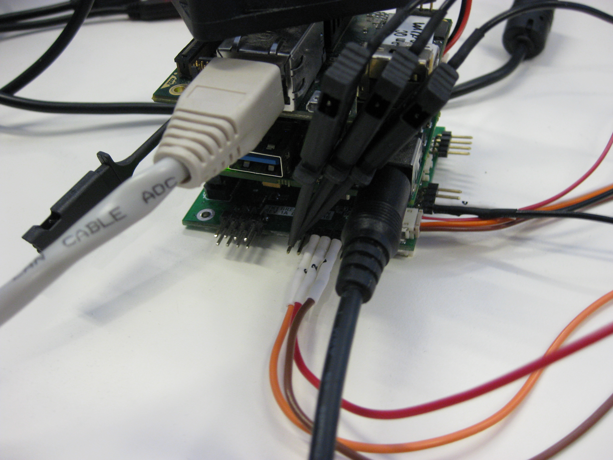

In Logic we add the new channels and configure a SPI analyser for them.

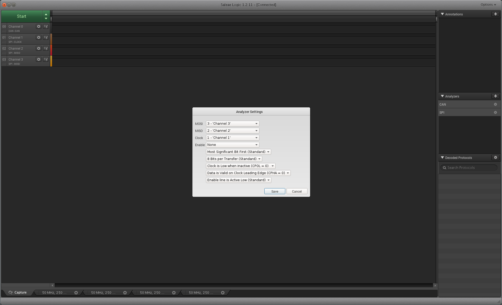

After running the scan again while sending a CAN message we now see the
CAN frame sent on the bus followed by a few SPI transactions between the
Processor and CAN controller.

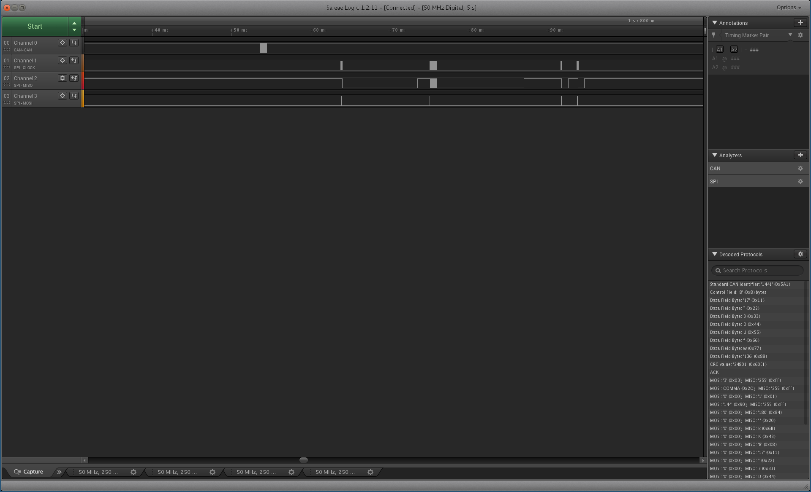

Zooming in on a single SPI transaction we see that the CAN driver send
0x03, 0x2C and the CAN controller respond with 0x01. This corresponds to
Read register 0x2C (Interrupt flag register) and the register value
being returned as 0x01 (Message received). Under decoded protocols you
can see both CAN messages and SPI messages that were sent.


### GPIO Interrupt line
 We finally connect the probe to the
interrupt line. The daughter board configures the CAN controller to
interrupt over GPIO3 which is exposed as Pin 4 on pinout J5 as described
in the
[TK1-SOM Reference guide](http://coloradoengineering.com/wp-content/uploads/2016/12/Reference-Guide_FINAL.pdf). This is at the back of the TK1 relative to our
setup and we connect the probe as shown:

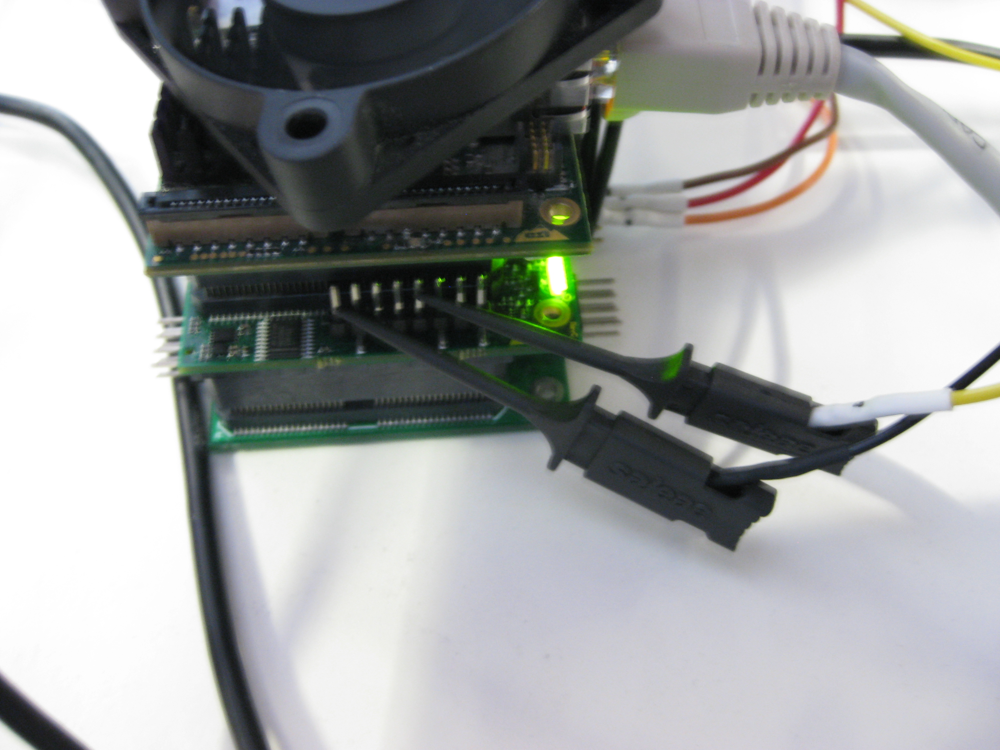

We capture a message being sent again and now we can see the CAN message
being sent, the controller interrupting the GPIO line and then the
processor responding to the interrupt with SPI transactions. Eventually
the interrupt line is reset once the processor has read out the received
CAN message from the CAN controller.

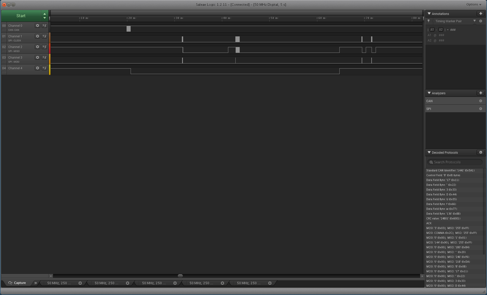
