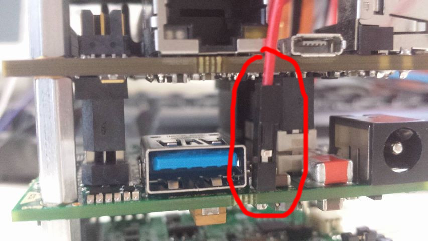
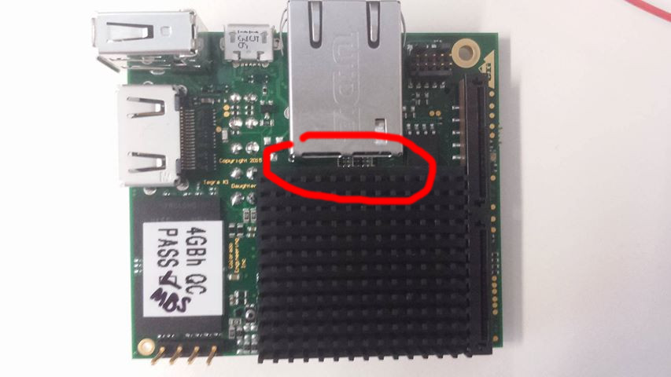
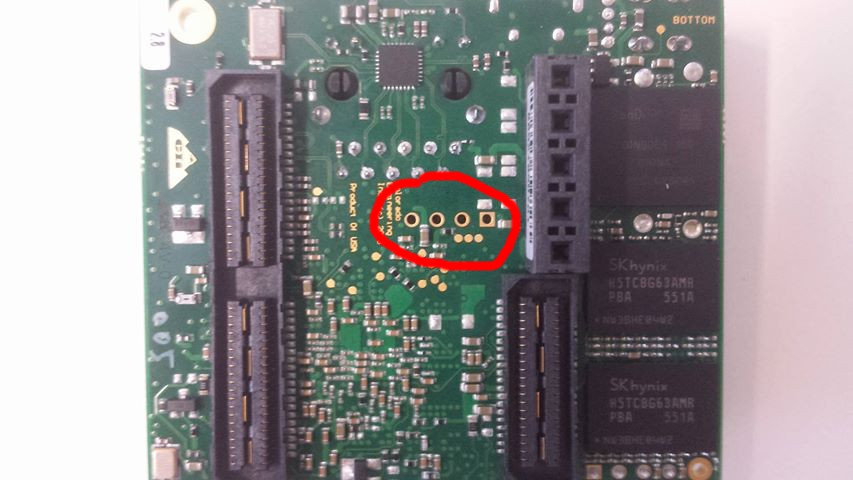
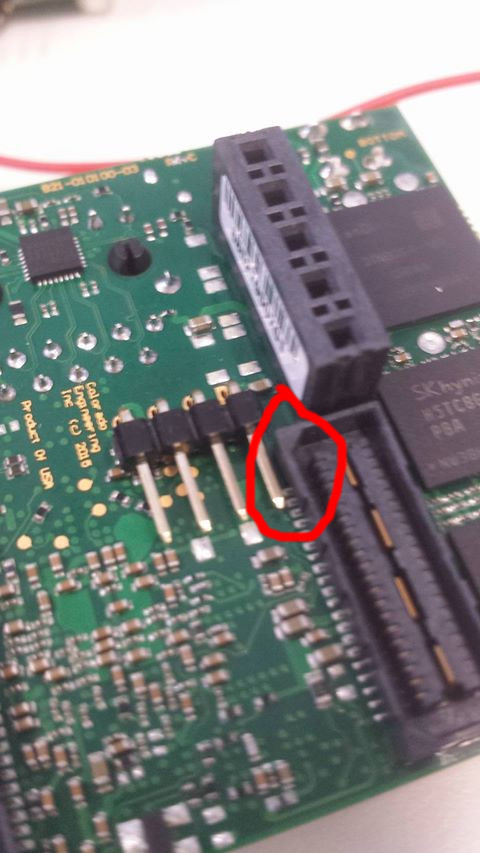
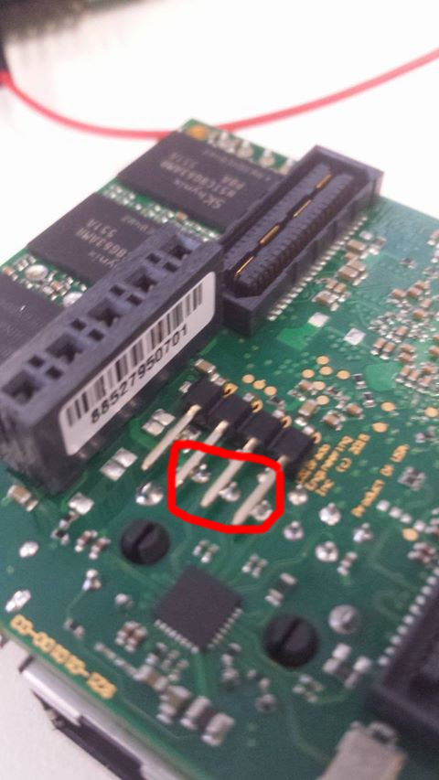
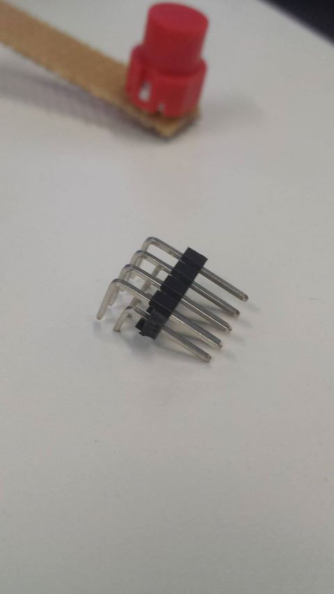
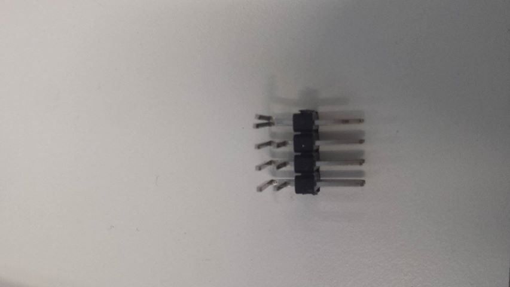
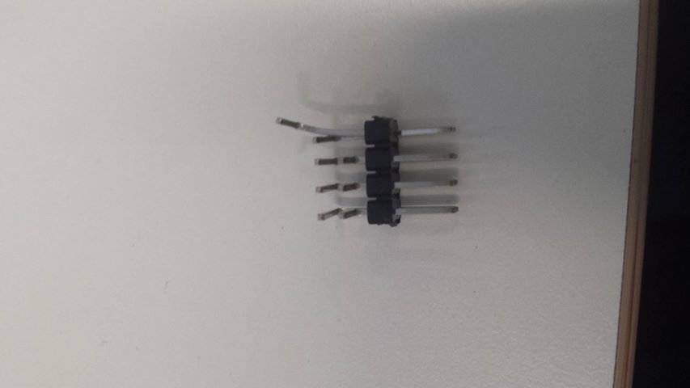
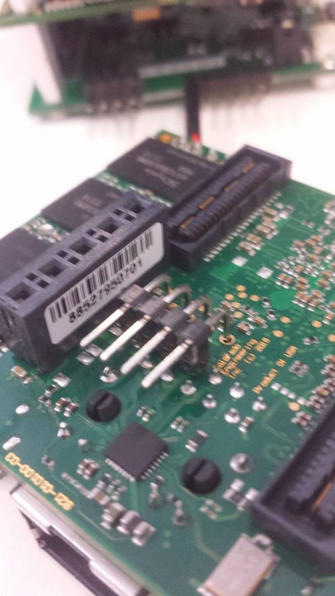
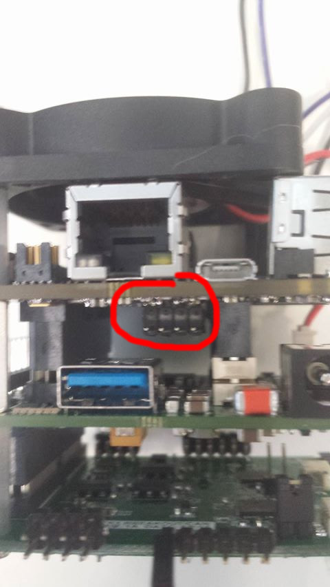

# TK1-SOM Hardware Modifications

## Adding a second UART connector

### The issue:
Note: if you are using our
[IO-Daughterboard](../DaughterBoard) , this is uneccessary;
instead a straight-line passthrough jumper is used to hook up to level
converters on the daughterboard.

The TK1-SOM has a secondary UART connection, however it's a bit of a
pain to get to as a normal jumper won't fit sandwiched between the
boards (below left), and you can't get to the connection from the top
because of the fan & heatsink (below right).

### What it looks like:

Viewed from the bottom of the CPU board, the secondary UART is the 4
unpopulated pins just under the ethernet jack pins (see below):

### Right-angle connectors?
 Initially I looked at normal right-angle
0.1" headers, but they don't fit in either direction!

Above left: you can't connect a jack as there is no clearance to the
mezzanine connector. Above right: the pins will likely short with the
ethernet jack pins.

### Solution: modify a dual-row header..

A normal dual-row 0.1" header looks like this:

But we only need it for clearance - which we can do by just taking out
the bottom 2 rows of pins:

(It's easiest to use pliers to push the pins out a little bit, bend
them, and then pull them all the way out)

Eventually, you end up with this (Only the top row left):

Now you can solder the pins on (make sure the pins are directed toward
the ethernet jack so there's enough clearance!)

Make sure not to use too much heat in this step, there are a few 0201
components nearby which can easily come off just because of the nearby
heat. Also be sure to keep the iron angled away from the connectors as
it is quite easy to accidentally melt them.

Once done, put the TK1-SOM back together and you have some easily
accessible UART pins:

The pinout & levels are described in the TK1-SOM reference guide - this
connector is called J2000. (Pin 1 is the square pad)

Note the 1V8 logic levels!
