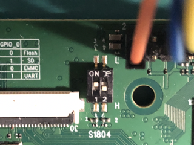

# Pine64 Star64

The Star64 is a RISC-V SBC by Pine64 based on the StarFive JH7110 SoC. Check
the [Pine64 Wiki](https://wiki.pine64.org/wiki/STAR64) for details.



The StarFive JH7110 SoC is comprised of the SiFive U74-MC (four 64-bit U74
cores and one 64-bit S7 core) and one SiFive E24 32-bit core. Note that by
default seL4 is setup to use the U74 cores as neither the S7 or E24 core has
S-Mode, which seL4 requires.

The Star64 arrives with the following boot process from the SPI flash:

1. U-Boot SPL starts
2. OpenSBI starts
3. U-Boot proper starts

From U-Boot proper you can then load and start an seL4 image, see below for details.

## Building the GCC toolchain



## Building seL4test



## Booting via microSD card

```sh
fatload mmc 1 0x60000000 sel4test-driver-image-riscv-star64
go 0x60000000
```

## Booting via TFTP

If you have setup a TFTP server, enter the following commands on the U-Boot console
to load an image via the network.

```sh
dhcp
tftpboot 0x60000000 <YOUR_TFTP_SERVER_IP_ADDRESS>:sel4test-driver-image-riscv-star64
go 0x60000000
```

## Producing a SD card bootable image

If you require a custom U-Boot or have other constraints, you may need to create
your own bootable image. The following instructions show how to make a bootable
image for a microSD card that can then be inserted into the Star64. Note that you
will need to change the booting mode via the DIP switch, like so:



The boot process of this bootable image is the same as the SPI flash booting
process. Unfortunately, at the time of writing, U-Boot does not support booting
in M-Mode which means U-Boot must be loaded by an SBI in S-Mode.

### Acquiring sources

At the time of writing, mainline U-Boot does not support the Pine64 Star64, hence
if you want to built it yourself, there is a patch to apply available on a fork of
U-Boot. Note that these instructions are reproduced from [here](https://github.com/Ivan-Velickovic/star64_sdcard).

```sh
git clone https://github.com/Fishwaldo/u-boot.git --branch Star64
git clone https://github.com/riscv/opensbi.git
git clone https://github.com/starfive-tech/soft_3rdpart.git
```

### Compiling U-Boot and U-Boot SPL

```sh
CROSS_COMPILE=<RISCV_TOOLCHAIN> make -C u-boot pine64_star64_defconfig
CROSS_COMPILE=<RISCV_TOOLCHAIN> make -C u-boot
```

### Compiling OpenSBI

Now that we have U-Boot, we can make the OpenSBI image that contains U-Boot as the
payload.

```sh
mkdir -p opensbi_build
make -C $OPENSBI PLATFORM=generic \
                    CROSS_COMPILE=<RISCV_TOOLCHAIN> \
                    FW_FDT_PATH=u-boot/arch/riscv/dts/pine64_star64.dtb \
                    FW_PAYLOAD_PATH=u-boot/u-boot.bin \
                    PLATFORM_RISCV_XLEN=64 \
                    PLATFORM_RISCV_ISA=rv64imafdc \
                    PLATFORM_RISCV_ABI=lp64d \
                    O=opensbi_build \
                    FW_TEXT_START=0x40000000 \
```

Now we need to take the payload and turn it into a Flattened uImage Tree (FIT) for U-Boot SPL
to load.

First we'll need an ITS file to describe the FIT:

```sh
/dts-v1/;

/ {
    description = "U-boot-spl FIT image for JH7110 Pine64 Star64";
    #address-cells = <2>;

    images {
        firmware {
            description = "u-boot";
            data = /incbin/("opensbi_build/platform/generic/firmware/fw_payload.bin");
            type = "firmware";
            arch = "riscv";
            os = "u-boot";
            load = <0x0 0x40000000>;
            entry = <0x0 0x40000000>;
            compression = "none";
        };
    };

    configurations {
        default = "config-1";

        config-1 {
            description = "U-boot-spl FIT config for JH7110 Pine64 Star64";
            firmware = "firmware";
        };
    };
};
```

Now, invoke the `mkimage` tool to generate the FIT.

```sh
mkimage -f <ITS_FILE> -A riscv -O u-boot -T firmware opensbi_uboot_fit.img
```

### Add SPL header to U-Boot SPL binary

First we need to compile a small tool that adds the SPL header to the U-Boot
SPL image.

```sh
cd soft_3rdpart/spl_tool
make
```

Now invoke the tool on the U-Boot SPL image:

```sh
spl_tool -c -f u-boot/spl/u-boot-spl.bin
```

You should now have a file called `u-boot-spl.bin.normal.out`.

### Generate bootable image

Lastly, we need to create the bootable image from all of these binaries. For this
the `genimage` tool is used.

First, we'll need the configuration file. Note that you will have to change the
paths to match where you build each binary.

```conf
image sdcard.img {
    hdimage {
        gpt = true
    }

    partition spl {
        image = "/path/to/u-boot-spl.bin.normal.out"
        partition-type-uuid = 2E54B353-1271-4842-806F-E436D6AF6985
        offset = 2M
        size = 2M
    }

    partition uboot {
        image = "/path/to/opensbi_uboot_fit.img"
        partition-type-uuid = 5B193300-FC78-40CD-8002-E86C45580B47
        offset = 4M
        size = 4M
    }
}
```

Now we can pass this configuration, a temporary directory path, and a root
directory path to the genimage tool.

```sh
# genimage expects these directories to exist before invoking it
mkdir -p temp
mkdir -p root
# <INPUT_PATH> represents the top dir from where the genimage tool looks for
# the image paths in the configuration file
genimage --config <GENIMAGE_CONFIG> --inputpath <INPUT_PATH> --tmppath temp
```

The final image will be `images/sdcard.img`. You can either use the `dd` utility
or the [balenaEtcher](https://www.balena.io/etcher) program to write the image to
your microSD card.
