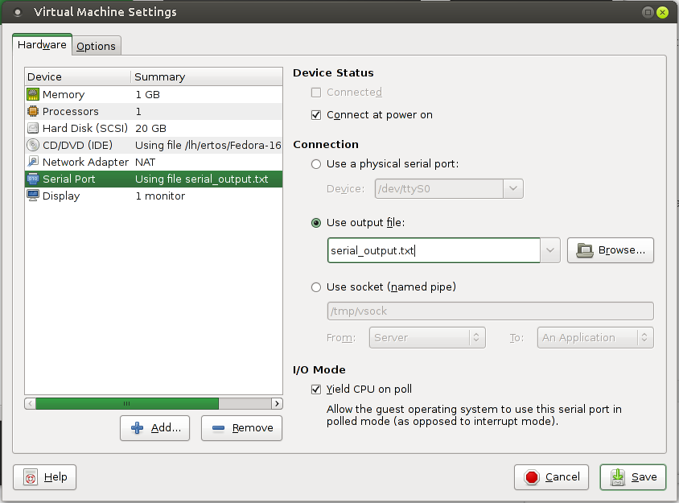

# seL4 on VMware


This is a quick guide on how to run seL4 x86 on VMWare Workstation/Player.
Written based on decently up-to-date versions Workstation 9 & 10 Player 5 & 6
and for a Linux host machine. May work on Mac host machine, won't work for
Windows host (although general idea should be similar).

This guide assumes that your project is all set up and configured to build for
x86. Read the [set up
instructions](../../projects/buildsystem/host-dependencies.html) otherwise.

## Setting up a VM


Both the free non-commercial Player and Workstation run seL4 fine; the
difference with player is that additional setup is required to automate
everything if you use Player. In order to start / stop VMWare from the
command line you need to install VMWare VIX API for Player. Workstation
comes with VIX and Player both installed.

Once you get VMWare installed and running, go on and create a VM for
seL4 (choose install OS later, and choose "Other" for guest OS type).

### Set Up Serial Port


After you have a VM, we want to add a serial port so we can see the
stuff we print out. Go machine configuration -> Add device ->
Serial port.

Make sure this is the only serial port, and it is serial port 0. If you
selected Guest OS type "Ubuntu" or something VMWare may set up a secret
hidden serial port which you can't edit from the GUI. Choose "Other" for
guest type.



There are three options for the serial port

1.  **Output to a text file** (easiest but output only). The VM
    will dump its serial output to a text file when it runs, and you
    can simply go `less -F <file>`.
2.  **Use physical serial port** (best but requires serial cable +
    another machine to minicom/picocom off it). Set it to /dev/ttyS0
    or something.

3. **Output to a socket** (allows input/output but annoying to
set up). You'll want to apt-get install socat and then run something
like:
```bash
#!/bin/bash
while true; do
    socat -d -d UNIX-CONNECT:/tmp/vsock,forever PTY:link=/dev/tty99
done
```
and
    then minicom to `/dev/tty99` or
    to `/dev/pts/<whatever socat decides to use>`.

Choose depending on whether you can get a serial cable from your
machine, whether you need output...etc. Easiest is to just use a text
file.

### Install GRUB2


Once you have a VM, you'll want to set up the hard disk partitions and
get GRUB2 on the virtual hard disk and its MBR somehow. Easiest way to
do this is simple install some Linux distro that has GRUB2 (Ubuntu
Debian Fedora...etc). If you want to save some hard disk space you can
try
[Ubuntu Minimal](https://help.ubuntu.com/community/Installation/MinimalCD). Choose to install GRUB to the MBR when installing your OS.

Alternatively if you feel like extra headaches to save space and time
you can try install GRUB2 manually with grub-install from some Linux
Live CD image.

### Add GRUB2 Option To Run seL4


Now we want to edit its **grub.cfg** (usually in /grub2 or /boot/grub
or something like that) somehow and modify it to boot our seL4 kernel +
userland binary.

Simplest method is to simply use VMWare player to boot into the guest OS
you just installed, and then edit the grub.cfg from the guest OS itself.

Another method is to use **vmware-mount**:
```bash
# Usage: vmware-mount diskPath [partition num] mountPoint
mkdir /tmp/vmount
vmware-mount /path/to/your/HD.vmdk /tmp/vmount
# Now do your editing in /tmp/vmount.
vmware-mount -d /tmp/vmount
```

Once you have grub.cfg open in your favourite editor, Add an extra
option to it:
```
menuentry 'seL4' --class fedora --class gnu-linux --class gnu --class os {
    load_video
    insmod gzio
    insmod part_msdos
    insmod ext2
    set root='(hd0,msdos1)'
    search --no-floppy --fs-uuid --set=root <deviceID>
    echo 'Loading seL4 kernel'
    multiboot /kernel-image-ia32-pc99
    echo 'Loading initial module ...'
    module /sel4-image-ia32-pc99
}
```

Of course, change the `--set=root <DeviceID>` line to your
DeviceID (set the DeviceID from other entries already in your grub.cfg),
and also change the `sel4-image-ia32-pc99` to match the name of your
binary image that your Make produces (look in your build logs or in
`images/` folder).

Also may be a good idea to add `set default=<seL4 menu index>`
to the grub.cfg, so grub is configured to boot seL4.

## Using The VM to run seL4


Now you have a VM ready, you'll want to copy your built kernel +
userland binary image over onto its HD, and then start the VM, and
choose the seL4 option in GRUB, and then monitor the serial output. You
will need to repeat this entire above process every time you build & run
seL4. Fortunately I have a script does all of the above in one go (may
need editing of paths here and there to fit where you put things).

[Download seL4vmw.py](seL4vmw.py)

### Do It Manually


First, use vmware-mount to mount the vmdk disk image. Then copy your
newly built kernel and user binaries over. Then, unmount using
vmware -d.

Then start your VM (either from VMWare Player GUI or using the vmrun
script from VIX API), and choose seL4 boot option. Monitor serial
output. If you've set up the seL4 option as the grub default then you
just need to wait for the grub time out.

If your kernel fails an assert during startup, make sure your kernel
repo is up to date.
