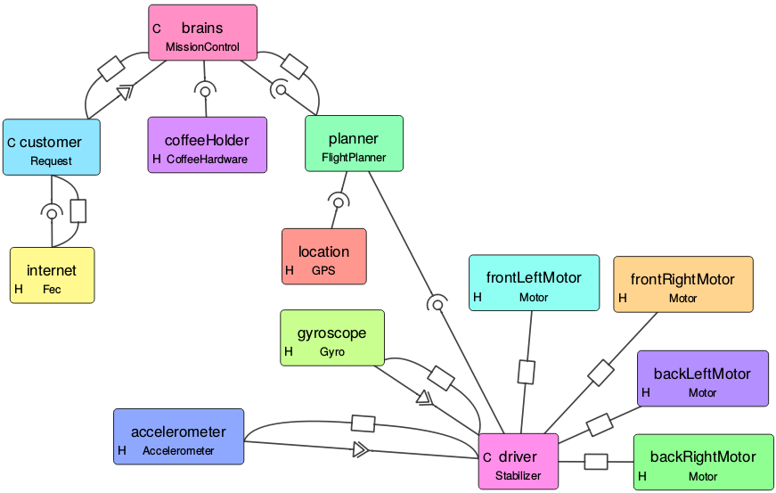
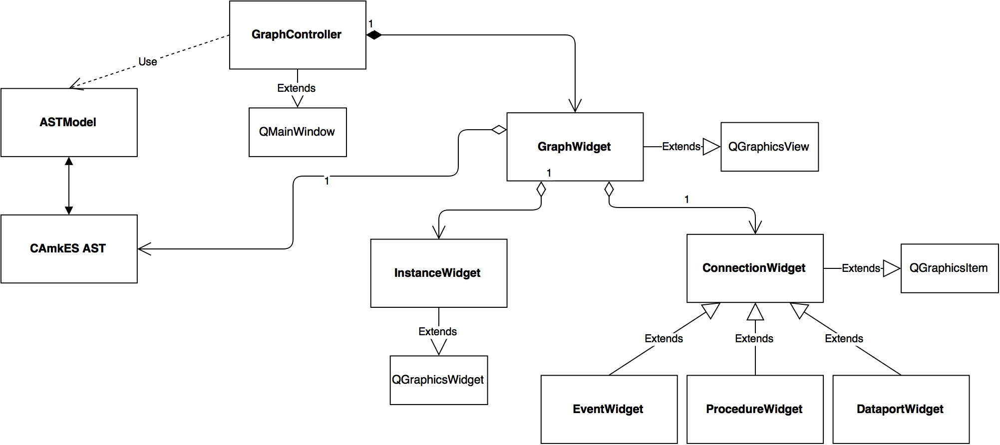

# VisualCAmkES

VisualCAmkES, also known as Visualisation of CAmkES, is a tool that allows one
to visually understand a CAmkES system, how it works and how the different
components are connected together. This makes understanding easier and more
intuitive than traversing CAmkES code. An example of a graph generated by this
tool is shown below



Currently this program loads in a top-level camkes file and generates a graph
from it. It also lets the user interact with the graph (zoom, pan and move
nodes). The tool is a foundation for a CAmkES IDE. To create a CAmkES IDE, one
 must first be able to display a current CAmkES system and allow interaction.
And that is what this project does. Since it was clear that this project should
become an IDE in the future, the code has been written with that in mind.

The tool is written in python, for two reason. Python provides cross-platform
compatibility, which doesn’t require heavy, insecure Java virtual machine. The
tool uses the CAmkES Ast and Parser API, and since this was written in python,
this tool was also written in python.

## How to Install

Follow the [setup instructions for CAmkES](../setting-up.md) to obtain a
repository collection checkout. The tool should is found in
`projects/camkes-tool/camkes/visualCAmkES/`.

Running the tool requires a few added dependencies: Graphviz and Qt. Qt is a
framework, which includes GUI, Network, Concurrency and other things. This
installation procedure assumes you have the rest of CAmkES working.

### Installing Qt

For Debian/Ubuntu users, there are two ways to install this. The easy way is to
apt-get the items. The "long" way is to build from source. For Mac, use homebrew.

Qt is quite big, and the majority of it is unnecessary for VisualCAmkES. So we
recommend to build from source for personal computers.

#### From apt-get

```bash
sudo apt-get install python-pyqt5
sudo apt-get install python-pyqt5.qtsvg
```

#### From source

```bash
cd /some/temp/directory/like/Downloads
git clone https://github.com/qt/qt5.git
cd qt5
git checkout 5.5
./init-repository --no-webkit --module-subset=qtbase,qtsvg

# Check where Qt will install - needed for PyQt5
./configure --help
# Have a look at where qt will be installed, for me it was installed in /usr/local/Qt-5.5.1

./configure -release -nomake examples -nomake tests -opensource -confirm-license # add "-qt-xcb" for linux

make -j4 # This takes a long time (1-3 hrs)
make install
```

### Installing Graphviz

For Linux:

```bash
sudo apt-get install graphviz
sudo pip install graphviz
sudo pip install pydotplus
```

For Mac:

```bash
brew install graphviz
```

### Installing other dependencies

```bash
sudo pip install ansi2html
```

## How to use

This program is easy to use, yet quite powerful. To start the application, from
the root of the repository collection checkout, run:

```bash
python projects/camkes-tool/camkes/visualCAmkES/visualCAmkES
```

### Opening a File

To open a file, click File->Open. Then select a **top-level
camkes file**. Your graph will load.

### Manipulating the graph

In the right, you have a few buttons:


The button's name should be self-explanatory. Autolayout will use graphviz to
reposition the nodes into a "nice" format. In my experience, graphviz never
gives a nice layout, but it does give a good starting point for you.

You can move the instances around by click & dragging each box. The
connections will continually redraw as you move the box. There is a
minimum distance to see the symbol for each connection.

### Exporting and Saving

As you change the graph, **the program automatically saves a .layout file**,
which contains the current
position of each box. This means that you can close the python
application, and when you reopen it, your latest layout will appear.

You can export an image, into either PNG or SVG.

1. Clicking Save Image or File->Export Image.
2. Choose either PNG or SVG from the combo-box (first input).
    a.  For PNG, resolutions is mandatory.
    b.  For SVG, no input is mandatory.
3.  Click OK.
4.  Choose a place to save your file, and name your picture.

### Import Paths

In some cases, users may have external import paths which is usually a
parameter to the camkes parser. In order to visualise these camkes
projects, the user can add import paths by doing the following:

  1.  Click Edit -> Add import paths

  2. In the dialog box, type (or paste) your import paths. These need to be
     absolute paths. To add many paths, have spaces between your paths.
    -  `/home/someUser/camkes-next/projects/FileExtender /home/someUser/camkes-next/projects/common`

A keyboard shortcut is also implemented, Cmd + I or Cmd + I .

### Key-mappings

The key-mappings are as follows:

|Task                |Linux/Windows|Mac    |
|--------------------|-------------|-------|
|Open                |Ctrl + O     |Cmd + O|
|Autolayout          |Ctrl + L     |Cmd + L|
|Export (Save) Image |Ctrl + E     |Cmd + E|
|Zoom In             |Ctrl + =     |Cmd + =|
|Zoom Out            |Ctrl + -     |Cmd + -|
|Add Import Paths    |Ctrl + I     |Cmd + I|

## How it works

### High-level overview



The above is quick UML class diagram. A few other classes isn't shown like
SaveOptionDialog - but these are helper classes.

The program is written in object-oriented style, Model-View-Controller
(MVC) paradigm. If you don't know what MVC is, its pretty much: Model
represents the data, the backend; View represents the front-end, what
the user sees; Controller keeps the Model and View in sync. Qt works on
a Model-View paradigm, which is very similar - except the Controller and
View are the same thing.

  1.  GraphController is the QMainWindow - and starts of the program. It
      takes the chosen file from the user, gets an AST presentation from
      the ASTModel, and passes it on to the GraphWidget (the view).
  2.  GraphWidget will traverse the AST, creating InstanceWidget for
      Instances and ConnectionWidget for Connections.
  3.  GraphWidget is a QGraphicsView - containing QGraphicsScene.
      InstanceWidget and ConnectionWidget are QGraphicWidget and
      QGraphicItem respectively. QGraphicScene handles the placements of
      QGraphicItems, and has functions for scaling (i.e. zoom), panning,
      moving of nodes etc.
  4.  The program primary works by events. Events are like mouse clicks,
      button presses etc.

Throughout my code, I use lazy instantiation. Most (if not all) global
variables are declared as properties. Lazy instantiation is when
properties are created only when they are first called. Lazy
instantiation is done because subclasses might have different
expectation of properties's class.

The getters and settings may trigger other events such as updating the
screen. Furthermore - it seems that when a property is passed down the
different classes, say from GraphWidget to ConnectionWidget, the getter
from GraphWidget is invoked. Hence, events can be triggered in
GraphWidget when ConnectionWidget access the properties.

### Layout

In order to save the layout information - the program saves a
.visualCAmkES.layout file. It starts with a . because it is purposefully hidden
(which won't work on windows ...). This file is a json file containing
dictionaries. The key is the instance name, the value is another dictionary. The
latter dictionary contains the position and whether it was hidden. Feel free to
view the .layout file, but changing it can risk losing the layout.

### Additional implementation details

- When connection widgets are deleted, ConnectionWidget.delete()
        must be called on the object. This is because connection widget
        is tracked by the from and to instance widgets, so it needs to
        delete itself from them.
- Context menu is a bit weirdly implemented. This is what I mean
        by weird: normally you would just create the menu and it all
        works - including closing of the menu. However this doesn't work
        with QGraphicScenes. So the solution is to add the context menu
        to the scene, and manually close it if the mouse was clicked
        anywhere outside the context menu.

Traversing the code using PyCharm IDE is highly recommended.
